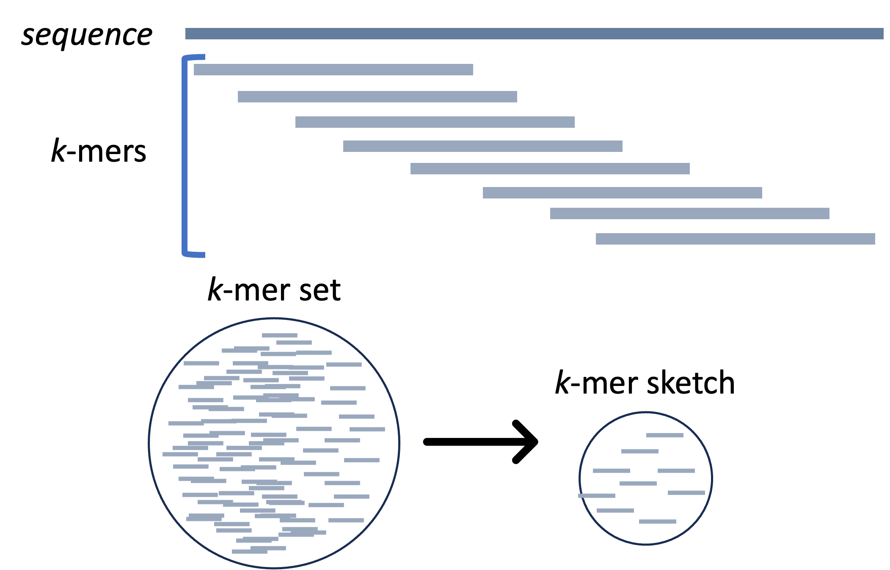
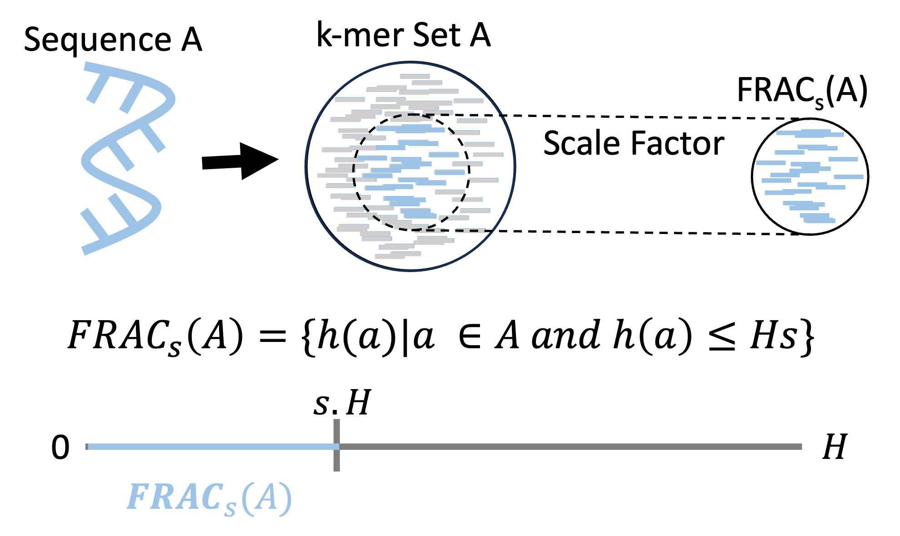
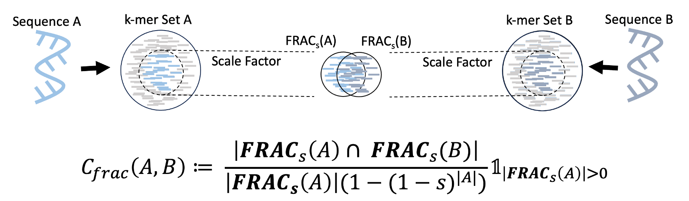
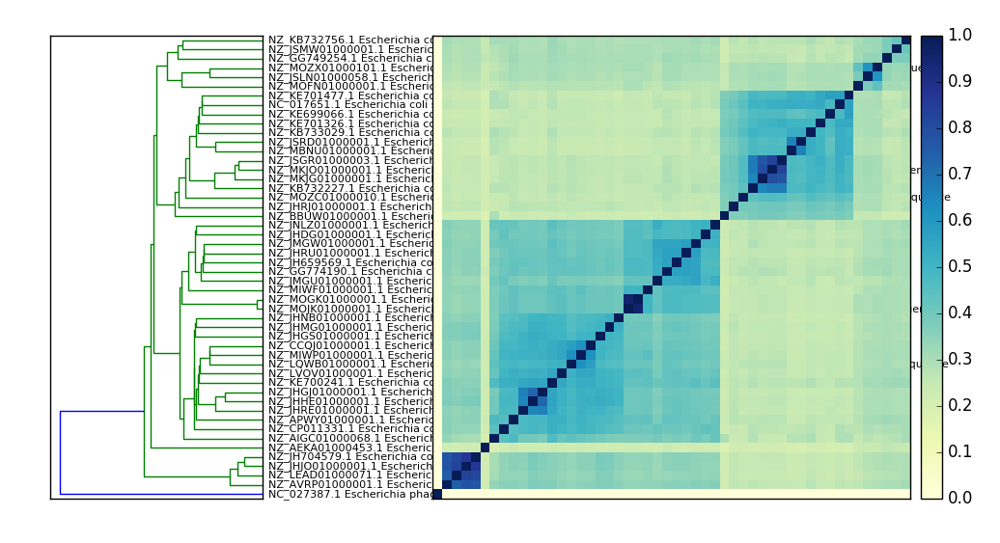

# Sourmash Tutorial

## Setup

Activate the workshop environment and navigate to the sourmash working directory:

```bash
conda activate ISMBtutorial
cd ~/ISMBtutorial/sourmash
```

Data downloads are covered in the [README](README.md). All commands below assume you are in `~/ISMBtutorial/sourmash/`.

# The MetaGenomQuest Tutorial
(Courtesy of Judith Rodriguez: https://github.com/bioinfwithjudith/sourmash_tutorial)

Each of you will get a random metagenomic sample and with the help of this tutorial, it is your quest to report the sample that you were tasked to study!

# Introduction

As sequencing methods become more inexpensive, producing genomic and metagenomic data becomes more available for 
large-scale analyses. Therefore, the development of quick and accuarate computational approaches become essential. Here, we introduce one such program, sourmash, which enables the minimization of sequencing data, similarity comparisons, species identification, among other tasks [[1]](#1).

## FracMinHash Sketch 

Utilizing sourmash, we can sketch a simpler representation of the original genomic or metagenomic datasets using the FracMinHash approach. 



Simply put it, a minimized set of k-mers (a subset of a string of length k) is produced from a fasta file with sequences of interest. The threshold to which the set is minimized is indicated by a scale factor, a parameter used to reduce the original set. Note that if a scale factor of 1 is utilized, the final FracMinHash sketch will be the original set of k-mers and as this number increases, the more the original set of k-mers will decrease for the final FracMinHash sketch. Each k-mer in the original set is passed through a Hash function, k-mers that minimize this function by having a value that is equal or less to the scale factor are used in the final FracMinHash sketch, FRAC(A) for example. 



## Comparing similarity of two FracMinHash sketches 

One of the beneficial tasks of sourmash is to estimate similarity between sketches offering the similarity indexes Jaccard and Containment. 

**Jaccard.** The Jaccard index is one of an earlier similarity index used to estimate the size of the union of two sets. However, as the sizes between two sets becomes more dissimilar, the less reliable is this estimation[[2]](#2).

**Containment.** The Containment index addresses this issue by estimating what is contained from one Set in another so the differing size of two sets is not an issue[[2]](#2).




# Preprocessing data utilizing sourmash sketch

To start, sketch `sample_001.fna`, a synthetic dataset used for tutorial purposes.

```
sourmash sketch dna data/sample_001.fna -p k=31,scaled=500 --output-dir output
```

|Parameter      |Description|
|---------------|----------|
|sourmash sketch| The command that sourmash utilizes to produce a sketch. |
|dna            | Identify that the sequences in our X file are DNA. If a different sequence type is used, like protein sequences, then this would be indicated as **protein** instead.|
|sample_001.fna       | Filename of interest. Please note that sourmash can produce sketches from either FASTA or FASTQ fules.|
|-p           | Flag to indicate a list of parameters. |
|k=31           | Tunable parameter required by the user to set. Larger k-mers are more specific; smaller k-mers are more sensitive. |
|scaled=500     | Our scale factor, which is also tunable.|

Utilizing sourmash sketch, we have produced the following  file, known as a signature file: **sample_001.fna.sig**. 

Inspect the signature:

```
sourmash sig describe output/sample_001.fna.sig
```

Below is the information you should see displayed on your end. Information such as the signature filename, sequence type, ksize and scale factor used are report. Additional information, such as total number of signatures and hashes are also shown, alongside other information.

```
== This is sourmash version 4.8.6. ==
== Please cite Brown and Irber (2016), doi:10.21105/joss.00027. ==

** loading from 'sample_001.fna.sig'
path filetype: MultiIndex
location: sample_001.fna.sig
is database? no
has manifest? yes
num signatures: 1
** examining manifest...
total hashes: 21
summary of sketches:
   1 sketches with DNA, k=31, scaled=1000             21 total hashes
```

# Comparing and Searching signatures

## Compare similarity of two sketches with sourmash compare

Sketch a second file for comparison. Note that sourmash requires matching k-mer size and scale factor for signature comparisons.

```
sourmash sketch dna data/sample_002.fna -p k=31,scaled=500 --output-dir output/
```

Estimate the containment between the two signatures with `sourmash compare`:

```
sourmash compare output/sample_001.fna.sig output/sample_002.fna.sig --containment
```

You should see the following output, where we have the names of the original fasta files and the containment between these files.

```
== This is sourmash version 4.8.6. ==
== Please cite Brown and Irber (2016), doi:10.21105/joss.00027. ==

loaded 2 signatures total.
NOTE: downsampling to scaled value of 1000

0-sample_001.fna        [1.    0.696]
1-sample_002.fna        [0.762 1.   ]
min similarity in matrix: 0.696
WARNING: size estimation for at least one of these sketches may be inaccurate. ANI values will be set to 1 for these comparisons.
```

These results can be reported to a csv file for further analyses.

```
sourmash compare output/sample_001.fna.sig output/sample_002.fna.sig --containment --csv output/compare.csv
```

|Parameter      |Description|
|---------------|----------|
|sourmash compare| The command that sourmash utilizes to compare two signatures. |
|sample_001.fna.sig       | signature filename 1. |
|sample_002.fna.sig       | signature filename 2. |
|--containment           | Flag to indicate we are using the similarity index containment. Other similarity indexes that can be used are **--jaccard** or **--ani** |
|--csv           | Flag to indicate we want to produce a CSV file to report a matrix with similarity indexes |

Looking at our newly produced csv file, we would expect the following similarity matrix:

```
sample_001.fna,sample_002.fna
1.0,0.6956521739836137
0.7619047624764425,1.0
```

## Search and report overall similarity percentages using sourmash search

To report what fraction of one sample is contained in another:

```
sourmash search output/sample_001.fna.sig output/sample_002.fna.sig --containment
```

|Parameter      |Description|
|---------------|----------|
|sourmash search| The command that sourmash utilizes to search how much a query is in a sample. |
|sample_001.fna.sig       | signature filename 1. |
|sample_002.fna.sig       | signature filename 2. |
|--containment           | Flag to indicate we are using the similarity index containment. Other similarity indexes that can be used are `--jaccard` |

According to the report below, there is ~76% of **sample_001.fna.sig** in **sample_002.fna.sig**.

```
== This is sourmash version 4.8.6. ==
== Please cite Brown and Irber (2016), doi:10.21105/joss.00027. ==

select query k=31 automatically.
loaded query: sample_001.fna... (k=31, DNA)
--
loaded 1 total signatures from 1 locations.
after selecting signatures compatible with search, 1 remain.

1 matches above threshold 0.080:
similarity   match
----------   -----
 76.2%       sample_002.fna
 ```


# Other example uses
(courtesy of the DIB lab: https://sourmash.readthedocs.io/en/latest/tutorial-basic.html)

These files were downloaded in the setup step (see [README](README.md)). Compute a scaled signature from the reads:

```
sourmash sketch dna -p scaled=10000,k=31 data/ecoli_ref*.fastq.gz -o output/ecoli-reads.sig
```

## Compare reads to assemblies

Use case: how much of the read content is contained in the reference genome?

Build a signature for an E. coli genome:

```
sourmash sketch dna -p scaled=1000,k=31 data/ecoliMG1655.fa.gz -o output/ecoli-genome.sig
```

and now evaluate *containment*, that is, what fraction of the read content is
contained in the genome:

```
sourmash search output/ecoli-reads.sig output/ecoli-genome.sig --containment
```

and you should see:

```

select query k=31 automatically.
loaded query: /home/jovyan/data/ecoli_ref-5m... (k=31, DNA)
loaded 1 signatures.

1 matches:
similarity   match
----------   -----
 31.0%       /home/jovyan/data/ecoliMG1655.fa.gz
```


Try the reverse, too!

```
sourmash search output/ecoli-genome.sig output/ecoli-reads.sig --containment
```

## Make and search a database quickly.

With the 50 E. coli signatures downloaded during setup (see [README](README.md)):

```
ls data/ecoli_many_sigs
```

Build a searchable database with `sourmash index`:

```
sourmash index output/ecolidb data/ecoli_many_sigs/*.sig
```

Search the database:

```
sourmash search output/ecoli-genome.sig output/ecolidb.sbt.zip
```

You should see output like this:

```
select query k=31 automatically.
loaded query: /home/ubuntu/data/ecoliMG1655.... (k=31, DNA)
loaded 0 signatures and 1 databases total.                                     

49 matches; showing first 20:
similarity   match
----------   -----
 75.9%       NZ_JMGW01000001.1 Escherichia coli 1-176-05_S4_C2 e117605...
 73.0%       NZ_JHRU01000001.1 Escherichia coli strain 100854 100854_1...
 71.9%       NZ_GG774190.1 Escherichia coli MS 196-1 Scfld2538, whole ...
 70.5%       NZ_JMGU01000001.1 Escherichia coli 2-011-08_S3_C2 e201108...
 69.8%       NZ_JH659569.1 Escherichia coli M919 supercont2.1, whole g...
 59.9%       NZ_JNLZ01000001.1 Escherichia coli 3-105-05_S1_C1 e310505...
 58.3%       NZ_JHDG01000001.1 Escherichia coli 1-176-05_S3_C1 e117605...
 56.5%       NZ_MIWF01000001.1 Escherichia coli strain AF7759-1 contig...
 56.1%       NZ_MOJK01000001.1 Escherichia coli strain 469 Cleandata-B...
 56.1%       NZ_MOGK01000001.1 Escherichia coli strain 676 BN4_676_1_(...
 50.5%       NZ_KE700241.1 Escherichia coli HVH 147 (4-5893887) acYxy-...
 50.3%       NZ_APWY01000001.1 Escherichia coli 178200 gec178200.conti...
 48.8%       NZ_LVOV01000001.1 Escherichia coli strain swine72 swine72...
 48.8%       NZ_MIWP01000001.1 Escherichia coli strain K6412 contig_00...
 48.7%       NZ_AIGC01000068.1 Escherichia coli DEC7C gecDEC7C.contig....
 48.2%       NZ_LQWB01000001.1 Escherichia coli strain GN03624 GCID_EC...
 48.0%       NZ_CCQJ01000001.1 Escherichia coli strain E. coli, whole ...
 47.3%       NZ_JHMG01000001.1 Escherichia coli O121:H19 str. 2010EL10...
 47.2%       NZ_JHGJ01000001.1 Escherichia coli O45:H2 str. 2009C-4780...
 46.5%       NZ_JHHE01000001.1 Escherichia coli O103:H2 str. 2009C-327...

```

## Compare many signatures and build a tree.

```
sourmash compare data/ecoli_many_sigs/* -o output/ecoli_cmp
```

Optionally, parallelize to 8 threads using `-p 8`:

```
sourmash compare -p 8 data/ecoli_many_sigs/* -o output/ecoli_cmp
```

and then plot:

```
sourmash plot --pdf --labels output/ecoli_cmp
```

which will produce files named `ecoli_cmp.matrix.pdf` and
`ecoli_cmp.dendro.pdf`.

Here's a PNG version:




# References
<a id="1">[1]</a> 
Irber, L., et al. (2024). sourmash v4: A multitool to quickly search, compare, and analyze genomic and metagenomic data 
sets. Journal of Open Source Software, 9(98), 6830. https://doi.org/10.21105/joss.06830

<a id="2">[2]</a> 
Koslicki, D., & Zabeti, H. (2019). Improving minhash via the containment index with applications to metagenomic analysis. Applied Mathematics and Computation, 354, 206-215.

<a id="3">[3]</a> 
Hera, M. R., Pierce-Ward, N. T., & Koslicki, D. (2023). Deriving confidence intervals for mutation rates across a wide range of evolutionary distances using FracMinHash. Genome research, 33(7), 1061-1068.

# Please proceed to the [YACHT tutorial](YACHT.md)
