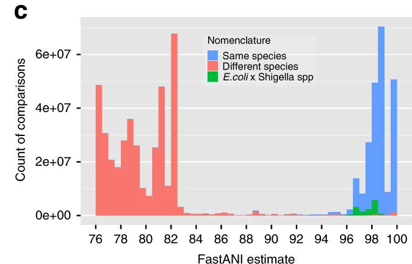
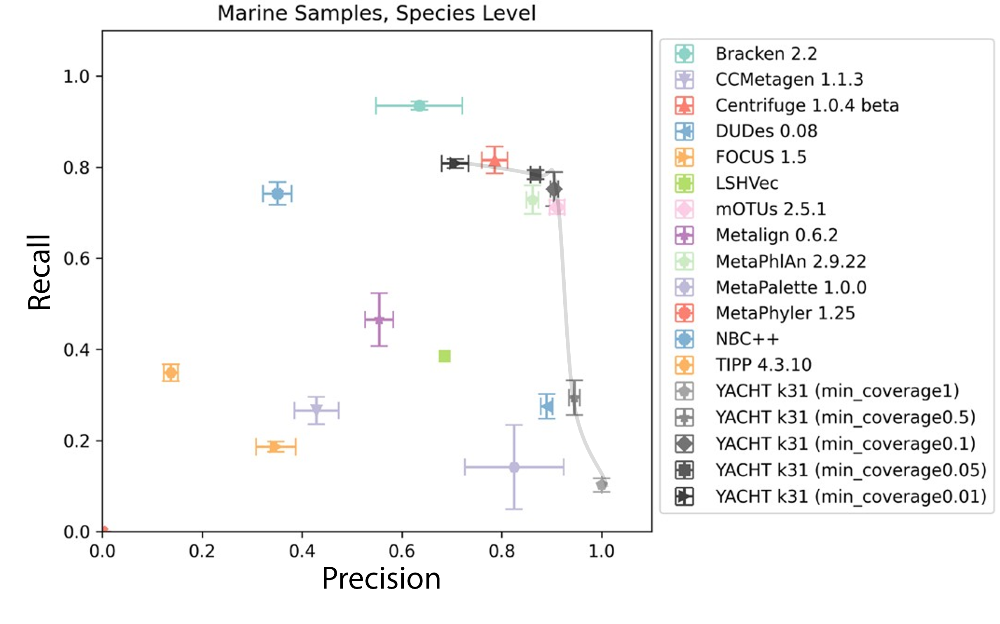
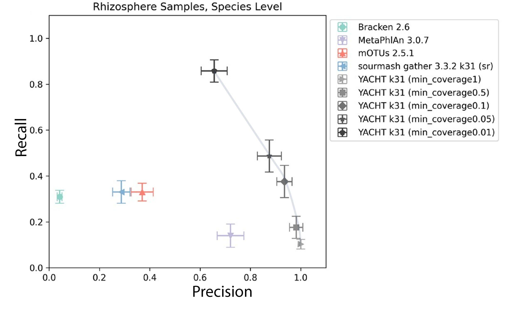

# YACHT Tutorial

In the [sourmash tutorial](Sourmash.md) we sketched a metagenomic sample and 15 candidate reference genomes, and we used `gather` and `search` to rank which references the sample resembles. We ended on a problem: at 0.5x coverage those rankings lean on hard thresholds and give us no principled statement of confidence. YACHT picks up exactly there, on the same data.

## What YACHT is

YACHT stands for **Y**es/No **A**nswers to **C**ommunity membership via **H**ypothesis **T**esting. It is a mathematically rigorous hypothesis test that decides, for each genome in a reference database, whether that genome is present in a metagenomic sample, with control over the error rate. You provide three numbers that define what "present" means for your use case:

1. an Average Nucleotide Identity threshold $A$, above which two organisms are considered biologically the same;
2. a coverage $c$, the fraction of a genome that must be seen for it to count as present;
3. a confidence level (via the significance $a$) that controls how much evidence the test demands.

YACHT then returns, for each reference, a yes/no call. Two things to be clear about from the start:

- **YACHT reports presence/absence, not relative abundance.** It answers "is this genome here?" not "how much of it is here?" A taxonomic profiler (MetaPhlAn, mOTUs, Bracken, and, as we will discuss, Sylph) answers the second question. These are different jobs, and YACHT is deliberately built for the first. Later in this tutorial we show how to decorate YACHT's present/absent calls with abundances if you need them.
- Because it is a hypothesis test, it comes with the usual machinery: a null hypothesis, a significance level, and controlled false positive and false negative rates. That rigor is the point. The derivation is on the workshop slides and in the [publication](https://doi.org/10.1093/bioinformatics/btae047).

## YACHT workflow


## Setup

Activate the environment and work from the same top-level directory as before:

```bash
conda activate ISMBtutorial
cd ISMBtutorial
```

There are three steps: sketch, train, and run (plus an optional format conversion at the end).

### 1. Sketch the sample and the reference

```bash
yacht sketch sample --infile demo/query_data/query_data.fq \
    --kmer 31 --scaled 1000 --outfile sketches/sample.sig.zip

yacht sketch ref --infile demo/ref_genomes/ \
    --kmer 31 --scaled 1000 --outfile sketches/ref.sig.zip
```

`yacht sketch` is a thin wrapper around `sourmash sketch`, the same FracMinHash machinery from the previous tutorial; it just also records the per-genome bookkeeping that YACHT's training step needs. So everything you learned about `k` and `scaled` carries over, and `sourmash sig describe` works on these files too.

### 2. Train

```bash
yacht train --ref_file sketches/ref.sig.zip --ksize 31 --num_threads 4 \
    --ani_thresh 0.95 --prefix demo_ani_thresh_0.95 --outdir ./ --force
```

The most important parameter here is `--ani_thresh`, the ANI threshold above which two references are treated as the same organism. Since no genome will *exactly* match what is in a real metagenome, this is how you decide how similar a reference must be to a sample organism to count as "the same." Use this figure as a rule of thumb:



(from https://doi.org/10.1038/s41467-018-07641-9). An ANI threshold of 0.95 means two genomes must be from the same species to be considered identical. For strain-level resolution you would raise it to 0.99, 0.999, and so on. It all depends on your use case.

Training also **deduplicates** the reference: any two genomes closer than `--ani_thresh` are collapsed to a single representative, because the test cannot distinguish organisms it considers "the same." Watch the output here. We started with 15 references but training keeps **14**. The pair it collapses is the two *Cloacibacterium caeni* isolates from the sourmash ANI vignette, which we measured at about 96% ANI, just above the 0.95 threshold. This is the callback promised earlier: the ANI number you compute in sourmash is exactly the number that governs how YACHT groups references.

### 3. Run

```bash
yacht run --json demo_ani_thresh_0.95_config.json --sample_file sketches/sample.sig.zip \
    --significance 0.99 --num_threads 4 \
    --min_coverage_list 1 0.6 0.2 0.1 0.05 --out ./result.xlsx
```

| Parameter | Description |
|-----------|-------------|
| `--json` | The config file written by `train`; it points at the trained database. |
| `--significance` | The minimum probability that a genome reported as absent is genuinely a true negative. It sets the acceptance threshold and so controls the test's false-negative rate: a higher value makes YACHT more reluctant to miss a genome that is present (more sensitive), a lower value makes it stricter about what counts as present. 0.99 is a good default. |
| `--min_coverage_list` | One or more coverage thresholds $c$ to report. A value of 0.6 means "at least 60% of the genome's distinctive k-mers must be covered by the sample to call it present." Lower is more sensitive (and less precise); higher is more specific (and less sensitive). |
| `--out` | Output spreadsheet (one sheet per coverage value). |

The output `result.xlsx` opens in any spreadsheet application (LibreOffice Calc, Excel, ...).

## Interpreting the results

`result.xlsx` has one sheet per `--min_coverage` value. By default each sheet lists the organisms YACHT calls **present** at that coverage. The headline result is how the number of present organisms changes as we vary the coverage requirement:

| sheet | organisms called present |
|-------|--------------------------|
| `min_coverage1.0`  | 2 |
| `min_coverage0.6`  | 3 |
| `min_coverage0.2`  | 5 |
| `min_coverage0.1`  | 5 |
| `min_coverage0.05` | 5 |

Recall the ground truth: the sample was simulated from 5 genomes at 0.5x coverage. Requiring `min_coverage=1.0` (the full genome must be covered) is far too strict for a half-covered sample, so YACHT confidently calls only the 2 highest-abundance organisms and stays silent on the rest, which is the correct, conservative behavior. Relax the requirement to 0.2 or below and all 5 truly-present genomes are recovered, with no false positives among the remaining references. This is the sensitivity/specificity dial in action, and it is why we recommend reporting a *range* of coverage values rather than a single one. In our benchmarking, a minimum coverage around 0.05 tends to balance the two:




To see the yes/no decision for every organism, not just the present ones, add `--show_all` to `yacht run`. The mechanics of the test then become visible in a few columns:

| column | meaning |
|--------|---------|
| `in_sample_est` | the call: `True` (present) or `False` (absent). This is the yes/no answer. |
| `num_matches` | genome-distinctive k-mers actually observed in the sample. |
| `acceptance_threshold_with_coverage` | the minimum number of matches needed to call the genome present, given the coverage and confidence you asked for. |
| `p_vals`, `actual_confidence_with_coverage` | the statistics behind the call. |

The test is then easy to read: an organism is called present when `num_matches` clears its `acceptance_threshold_with_coverage`. In our run, each of the 5 present genomes has hundreds of matches against a threshold of well under a hundred, while the absent references have `num_matches = 0` and are correctly rejected. That threshold is not a heuristic cutoff; it is derived from the hypothesis test so that its calls meet the confidence level (significance) you set, which is what separates YACHT from the hard 0.08-style cutoffs we saw in sourmash `search`.

## Presence/absence vs. taxonomic profiling

YACHT gives you a confident set of *which* genomes are present. Often the next question is *how much* of each, or *where in the taxonomy* they sit. Two things to know here.

**Converting to a standard taxonomic format.** YACHT can emit its calls in the [CAMI profiling format](https://github.com/CAMI-challenge/contest_information/blob/master/file_formats/CAMI_TP_specification.mkd):

```bash
yacht convert --yacht_output result.xlsx --sheet_name min_coverage0.2 \
    --genome_to_taxid demo/toy_genome_to_taxid.tsv --mode cami \
    --sample_name MySample --outfile_prefix cami_result --outdir ./
```

This walks each present genome up the taxonomy and produces a profile you can visualize. But look closely at the `PERCENTAGE` column: every present species is reported at an identical **20%** (5 species, split evenly), and the *Eubacterium* genus at 40% simply because two of the five species are *Eubacterium*. **Those percentages are not relative abundances.** They are presence, distributed uniformly, dressed up in an abundance-shaped format. Do not feed YACHT's CAMI output to anything that expects real abundances. The `--genome_to_taxid` file maps each genome to its taxonomy ID; you will usually build this yourself for a custom database. Other supported formats are `biom` and `graphlan`.

**If you do want abundances, decorate the calls with sourmash `gather`.** YACHT decides the confident present/absent set; `gather` (with abundance tracking) estimates how much of the sample each one accounts for. Sketch the sample tracking abundance, then gather:

```bash
sourmash sketch dna demo/query_data/query_data.fq \
    -p k=31,scaled=1000,abund --name query_abund -o sketches/query_abund.sig.zip
sourmash gather sketches/query_abund.sig.zip sketches/refs.sig.zip
```

Now the `p_query` (abundance-weighted) column is genuinely informative:

```
overlap     p_query p_match avg_abund
---------   ------- ------- ---------
0.8 Mbp       39.6%   34.4%       2.5    NZ_JAHLQE010000140.1 Eubacterium sp. MSJ-13 ...
0.6 Mbp       23.1%   18.4%       2.1    NZ_JAHLPV010000001.1 Acetivibrio sp. MSJd-27 ...
0.5 Mbp       16.6%   20.5%       1.7    NZ_JAHLPU010000070.1 Pseudoflavonifractor sp. MSJ-30 ...
314.0 kbp      8.1%    9.0%       1.3    NZ_JAHLQA010000007.1 Blautia sp. MSJ-19 ...
156.0 kbp      6.8%    5.4%       2.3    NZ_JAHLPZ010000001.1 Eubacterium sp. MSJ-21 ...
```

These are real, non-uniform abundance estimates, unlike YACHT's presence-only output. A clean pipeline is therefore: use YACHT to get a statistically defensible list of present genomes (controlling false positives at low coverage), then use `gather` to attach relative abundances to that list. YACHT tells you *whether*; gather tells you *how much*.

## How is this different from Sylph?

A natural question, since Yun William Yu is covering Sylph in this same session, and since the two tools grew out of the same idea: use FracMinHash-style sketches, plus an explicit statistical model of how k-mer coverage behaves, to make accurate calls at low coverage. They then aim that shared foundation at different targets.

- **YACHT is a hypothesis test for presence/absence.** Its output is a yes/no call per reference genome, with an explicitly controlled false-negative rate and a user-set ANI threshold, coverage, and confidence. The question it answers is "is this genome confidently present, and how sure can I be that a negative is really negative?" (Koslicki et al., [Bioinformatics 2024](https://doi.org/10.1093/bioinformatics/btae047)).

- **Sylph is an estimator and profiler.** It uses a zero-inflated Poisson model of k-mer multiplicity to debias the *containment ANI* between a genome and a metagenome under low coverage, and it turns that into a species-level taxonomic profile with relative abundances. The question it answers is "what is the ANI of the closest match, and what is its abundance?" (Shaw and Yu, [Nature Biotechnology 2024](https://doi.org/10.1038/s41587-024-02412-y)).

So the practical distinction mirrors the presence/absence-vs-profiling point above. If you want a rigorous, error-controlled yes/no for membership, for example building a curated set of confidently detected organisms while keeping false positives in check, YACHT is the tool. If you want a fast abundance profile or a coverage-corrected ANI estimate across a large panel of genomes, that is Sylph's design center. They are complementary, and both are far more principled about low coverage than the hard-threshold ranking we saw with raw `gather`/`search`. The lineage is worth noting too: both build directly on the containment-index and FracMinHash-confidence-interval line of work, with YACHT framing it as hypothesis testing and Sylph as abundance-corrected ANI estimation.

## Running on a real database

This demo uses 15 genomes so it finishes in seconds. For real work you would train against a full reference such as GTDB. The pre-built databases, instructions for building your own, and the `--genome_to_taxid` construction are all documented in the [YACHT README](https://github.com/KoslickiLab/YACHT/blob/main/README.md). The commands are identical; only the reference gets bigger.
